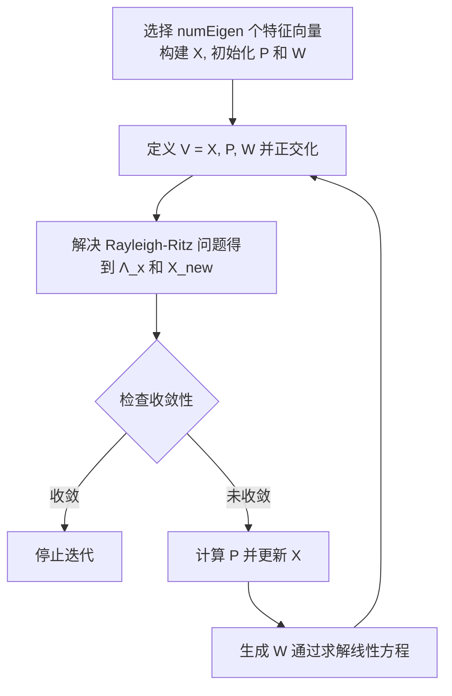

# GCGE代码框架及算法流程介绍
GCGE代码库主要实现了一种广义共轭梯度算法（GCG）。该算法旨在求解大规模特征值问题，结合了阻尼块反幂法、子空间投影方法和动态移位的逆幂法。此外，为了在需要大量特征对时减少投影子空间的维数，开发了一种移动机制。

## 一、目录结构
其中代码目录结构如下：
- `config/`：包含配置文件，用于设置项目的构建和编译参数。
- `docs/`：存放项目的文档资料，包括用户指南和开发者文档。
- `example/`：提供示例代码，展示如何使用该库的功能。
- `gcge/`：核心库文件夹，包含实现广义共轭梯度算法的源代码。
- `src/`：其他源代码文件，包括辅助功能及主程序。
- `.clang-format`：代码格式化配置文件，定义代码风格规范。
- `.gitignore`：Git 忽略文件，指定哪些文件或目录不应纳入版本控制。
- `CMakeLists.txt`：CMake 构建系统的配置文件，定义项目的构建过程。
- `LICENSE`：项目的许可证文件，规定了项目的使用和分发权限。
- `README.md`：项目的自述文件，提供项目的简介、安装和使用说明。

其中 gcge 目录下的代码采用模块化设计，包括以下主要组件：
- 算法实现：包含 GCG 算法的具体实现代码，负责执行特征值求解过程中的各个步骤。
- 数据结构：定义用于存储矩阵、向量等数学对象的数据结构，以及相关的操作函数。
- 工具函数：提供辅助功能，如矩阵和向量的初始化、内存管理、输入输出操作等。

## 二、算法步骤
GCG算法的主要步骤如下：
1. 选择 `numEigen` 个向量构造矩阵块 \( X \)，并初始化两个空矩阵块 \( P = [] \)、\( W = [] \)。
2. 定义 \( V = [X, P, W] \)，并在矩阵 \( B \) 的内积意义下对 \( V \) 进行正交化。
3. 求解 Rayleigh-Ritz 问题：
   \[
   (V^T A V) \hat{x} = \hat{x} \Lambda_x
   \]
   计算得到近似特征值矩阵 \( \Lambda_x \) 和特征向量 \( \hat{x} \)，然后更新新的特征向量：
   \[
   X_{\text{new}} = V \hat{x}
   \]
4. 判断特征对 \( (\Lambda_x, X_{\text{new}}) \) 是否收敛。如果最小的 `numEigen` 个特征对满足收敛准则，则迭代停止。
5. 否则，计算残差：
   \[
   P = X_{\text{new}} - X (X^T B X_{\text{new}})
   \]
   并更新 \( X = X_{\text{new}} \)。
6. 通过共轭梯度 (CG) 方法求解线性方程：
   \[
   (A - \theta B) W = B X (\Lambda_x - \theta I)
   \]
   其中初始迭代值取 \( X \)，偏移量 \( \theta \) 动态选择。
7. 返回 **步骤 2** 继续迭代。

## 三、算法流程图
算法整体流程如下：


## 四、关键接口说明
从第三节可以看出，GCG算法主要包括“初始化”、“解决 Rayleigh-Ritz 问题”、“计算P、W”、“检查收敛性”、等几个过程。下面对这些接口进行详细介绍。

```cpp
/**
 * @brief 该函数的主要目的是初始化矩阵V的X部分，并确保其X部分的列向量关于矩阵 B 正交。通过以下步骤实现：
 * 1) 定的近似特征向量初始化部分列。
 * 2) 对初始化的列进行正交化。
 * 3) 对剩余列进行随机初始化并正交化。
 * 4) 确保最终生成的列数满足要求。
 * @param V 输入：要初始化的矩阵; 输出：矩阵X部分已完成随机初始化
 * @param ritz_vec 已给的近似特征向量(其地址同特征向量地址，第一次传入时是随机值)
 * @param B B矩阵
 * @param nevGiven 已给的近似特征向量个数
 */
static void InitializeX(void **V, void **ritz_vec, void *B, int nevGiven)

/**
 * @brief 调用 Rayleigh-Ritz过程 求解子空间投影问题： V^H A V C = V^H B V C \Lambda
 * 公式中C：特征向量矩阵, \Lambda: 由特征值形成的对角线矩阵
 * Rayleigh-Ritz过程将大规模特征值问题转化为小规模特征值问题并求解其特征值和特征向量
 *
 * @param ss_matA (输出变量)用于存放子空间投影问题的矩阵V^HAV，一个二维数组，大小为 (sizeV−sizeC)×(sizeV−sizeC)
 * @param ss_eval (输出变量)存储计算得到的小规模特征值问题的特征值，一个一维数组，大小为 sizeV−sizeC
 * @param ss_evec (输出变量)存储计算得到的小规模特征值问题的特征向量，一个二维数组，大小为 (sizeV−sizeC)×(sizeV−sizeC)
 * @param tol (输入变量)求解小规模特征值问题的阈值参数，用于控制特征值求解的精度。
 * @param nevConv (输入变量)当前收敛的特征值个数
 * @param ss_diag (输出变量)存储子空间投影问题的矩阵ss_matA的对角部分
 * @param A (输入变量)刚度矩阵
 * @param V (输入变量)子空间基向量矩阵 V
 */
static void ComputeRayleighRitz(double *ss_matA, double *ss_eval, double *ss_evec, double tol,
                                int nevConv, double *ss_diag, void *A, void **V)

/**
 * @brief X = V C将子空间基底下的特征向量转换为原空间基底下的特征向量
 * 
 * @param ritz_vec (输出变量)原空间基底下的近似特征向量
 * @param V 输入 子空间的基底
 * @param ss_evec 输入 子空间基底下小规模问题的特征向量 C
 */
static void ComputeRitzVec(void **ritz_vec, void **V, double *ss_evec)

/**
 * @brief 检查收敛性
 * 
 * @param A 矩阵A
 * @param B 矩阵B
 * @param ss_eval 子空间问题的特征值（与原空间特征值相同）
 * @param ritz_vec 特征向量
 * @param numCheck 要检查的特征向量列数
 * @param tol 收敛容差
 * @param offset W子块的构造数据
 * @return int 返回已经收敛的特征值个数
 */
static int CheckConvergence(void *A, void *B, double *ss_eval, void **ritz_vec,
                            int numCheck, double *tol, int *offset)

/**
 * @brief 构建子空间P： P^{(i+1)} = X^{(i+1)} - X^{(i)} (X^{(i)T} B X^{(i+1)})，
 * 对应于 N_new - N_old (N_old^T B N_new)
 * 
 * @param V 输出变量-V子空间
 * @param ss_evec 子空间基底下小规模问题的特征向量 C
 * @param offset P子块构造数据
 */
static void ComputeP(void **V, double *ss_evec, int *offset)

/**
 * @brief 通过动态选取参数sigma的反幂法迭代步构建子空间W：
 * 块PCG法非精确求解 W, A W = B X \Lambda = B [N_2 N_1'] \Lambda(N_2 N_1')
 * 
 * @param V 输出变量-V子空间
 * @param A 刚度矩阵
 * @param B 质量矩阵
 * @param ss_eval 近似特征值
 * @param ritz_vec 近似特征向量
 * @param offset 矩阵W的列偏移索引， offset[0]为列数， [offset[idx*2+1],offset[idx*2+2]) 为第idx列位置索引
 */
static void ComputeW(void **V, void *A, void *B,
                     double *ss_eval, void **ritz_vec, int *offset)
```
